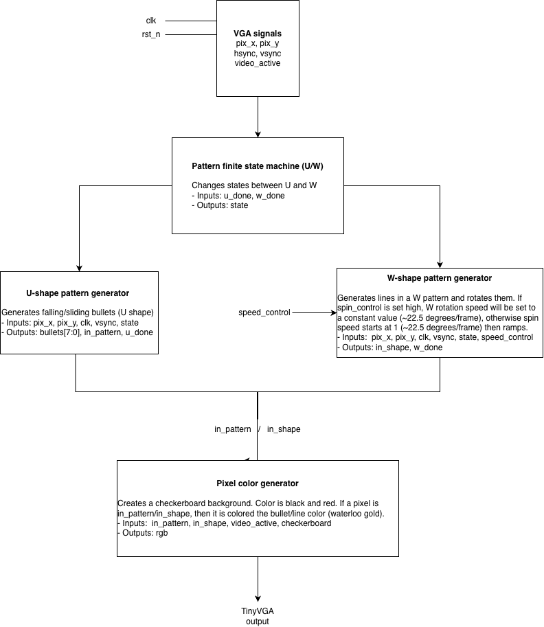

# More In-Depth Descriptions

## I/O Table

| Pin # | Input          | Output (VGA output) | Bidirectional  
|-------|----------------|---------------------|---------------|
|   0   | speed_control  | R[1]                |               |
|   1   |                | G[1]                |               |
|   2   |                | B[1]                |               |
|   3   |                | vsync               |               |
|   4   |                | R[0]                |               |
|   5   |                | G[0]                |               |
|   4   | *clk           | B[0]                |               |
|   5   | **rst_n        | hsync               |               |

*special, not actually input pin 6, has dedicated pin 
**special, not actually input pin 7, has dedicated pin

## Block Diagram

## In Depth Block Descriptions

U-state block
* Inputs: 
    * pix_x/pix_y (current pixel position)
    * clk
    * vsync
* Outputs:
    * bullets[7:0]
    * in_pattern
    * U_done (indicates end of U pattern process)
* Internals:
    * fall_y (vertical bullet offset from V_ORIGIN)
    * fall_speed (vertical movement per frame)
    * shift_side (horizontal movement per frame)
    * frame_count (#clock cycles/frame)
    * base_x[], base_y[] (initial bullet x y positions)
    * BULLET_SIZE (bullet collision radius)
* Process:
    * Starts when state = u_state
    * Arrays of wires bullet_pos_x/bullet_pos_y store the center of the bullet areas
    * Wire array “bullets” stores 6 bullet areas
    * Bullet initial positions are generated using hardcoded values and then adding/subtracting shift_side or fall_y
    * Shift_side is increased during the process of the pattern, causing horizontal translations. 
    * Fall_y is increased during the process of the patter, causing downwards translations. 
    * A frame_count is kept to slow the visual update speed so that it’s easier to see
    * The U-pattern translates downwards until a point, then the two halves translate inwards and keep going until they are no longer visible, which changes the state to w_state

W-state block
* Inputs:
    * pix_x, pix_y (current pixel position)
    * clk
    * video_active (ensures U/V stepping occurs only in visible region)
    * state == STATE_W
    * speed_control
* Outputs:
    * in_shape (1 if pixel lies inside the W lines)
    * w_done (indicates end of W pattern process)
* Internal Signals:
    * angle_idx (selects rotation angle)
    * cos_val, sin_val (from 8-step LUT)
        * 6 bits wide (signed)
    * start_u, start_v (initial U/V offset)
        * 14 bits wide (1 sign bit, 8 integer bits, 5 decimal bits)
    * row_u, row_v (start of each scanline)
        * 14 bits wide (1 sign bit, 8 integer bits, 5 decimal bits)
    * curr_u, curr_v (per-pixel U/V position)
        * 14 bits wide (1 sign bit, 8 integer bits, 5 decimal bits)
    * int_u, int_v (for shape comparison)
        * 9 bits wide (1 sign bit, 8 integer bits)
* Process (refer to image below):
    * Rotations are handled by creating a new plane that is rotated by θ and centered at (320, 240), which we call the u/v plane
    * The position of the current pixel in the u/v plane is determined per clock cycle
    * The initial u/v values are first determined. Then, for each step in the x direction, cosθ is added to u and sinθ is added to v. At the end of each row (step in y direction), cosθ is added to v and sinθ is subtracted from u
    * By rotating the u/v plane, it allows us to compute W using u/v coordinates
    * After each frame, the angle index is incremented, which determines which values get taken from the LUT
    * The LUT itself has 8 entries, meaning each increment to the angle index is a turn of 22.5 degrees
    * Symmetry logic is used to cover the other half of the rotations
    * The W pattern spins at either a constant speed of 1 (~22.5 degrees/frame) if speed_control is high, or otherwise speed starts at 1 and then increments by 1 until speed register overflows to 0, in which case w_done is set high and the state changes to u_state. 

* Image for W process:

## Tests and Test Results
* VGA Playground
    * To test the validity of our visuals, we used VGA Playground
    * The website simulates the VGA outputs from the chip, allowing us to visually confirm if our design is accurate or not
    * We used this to confirm that our animations were working properly, with no glitches or unexpected objects
    * This test passed
* VGA timing test
    * Although we have the website to simulate VGA outputs, we need to validate our timing generator
    * This test loops through 5 frames worth of clock cycles and ensures the following:
    * The current pixel coordinates given by the timing generator are accurate
    * An hsync pulse is triggered at the end of each row
    * A vsync pulse is triggered at the end of each frame
    * The signal that tells us whether or not we’re in the blanking region or not is accurate
    * This test passed
* W rotation test
    * We want to validate our plane rotation logic so that we know that the u/v coordinates are accurate and updated on time
    * To test this, we simulate the adding of cosθ/sinθ to u and v and compare the results to the actual values.These numbers should be the same, otherwise our test failed
    * This test passed
* State transition/timeout test
    * We want to ensure that the patterns keep looping between themselves
    To test this, we force a certain state and wait 500 frames. If the state does not swap in time, then our test has failed
    * This test passed

## Lessons Learned

This was a very fun project. It was an excellent way to deepen our understanding about the differences between hardware and software coding, as well as the best ways to optimize the former. There were many size and memory challenges throughout, and although that has caused the scope of our idea to shrink compared to the very beginning, this was still a valuable learning experience and are happy with what we ended up making (UW)!
